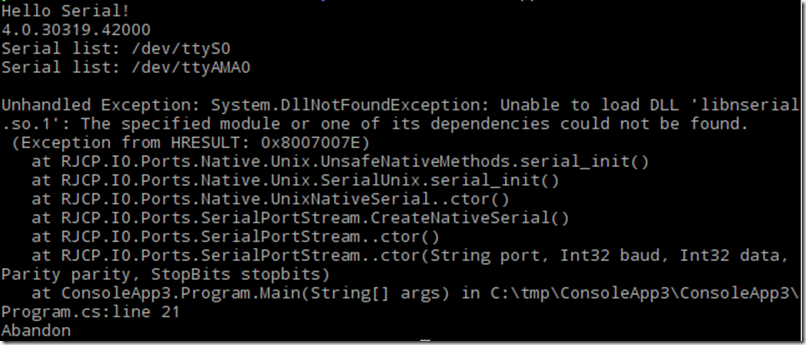

# Telnet
C# telnet client and server with RFC2217 option.

Use SerialPortStream from https://github.com/Ellerbach/serialapp for Linux Serial port.

Use System.IO.Ports.SerialPort for Windows.


# Requirement
This project used VSCode.

It's normal that you get this error.



The nuget package do not carry the necessary Linux serial library. You'll basically will need to compile them. It is documented on the GitHub page. In short:
```CMD
git clone https://github.com/jcurl/serialportstream.git
cd serialportstream/
cd dll/serialunix/
./build.sh
```


# Example
Build using 'Production' configuration for Linux build.
```CMD
dotnet publish  --configuration Production
```
